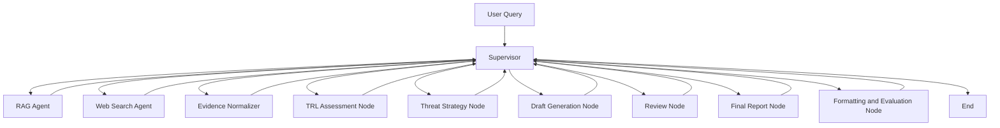

# Subject

SK hynix 관점에서 HBM4, PIM/AiM, CXL 관련 공개 자료와 최신 웹 신호를 수집하고, 경쟁사 기술 성숙도와 위협 수준을 비교해 기술 전략 분석 보고서를 생성하는 Agentic Workflow 프로젝트입니다.

## Overview

- Objective : HBM4, PIM/AiM, CXL 분야의 경쟁사 R&D 동향을 정리하고 SK hynix 관점의 대응 포인트를 도출합니다.
- Method : Supervisor 기반 workflow로 RAG, Web Search, Evidence Normalization, TRL 추정, 위협 분석, 보고서 생성, 평가를 순차 수행합니다.
- Tools : OpenAI API, Tavily API, LangGraph, Python, ReportLab

## Features

- PDF 자료 기반 정보 추출 및 RAG 검색
- Tavily 기반 최신 공개 신호 수집
- TRL 기반 기술 성숙도 추정 및 경쟁 위협 분석
- Retrieval 성능 평가: Hit Rate@K, MRR
- 보고서 생성 품질 평가: gold report 기반 SemScore, 품질 기준 체크, evidence-grounding 보조 점수
- 한국어 기술 전략 분석 보고서 Markdown/PDF 생성
- 확증 편향 완화: 경쟁사별 progress/risk query를 함께 수행하고 긍정/부정 신호를 분리해 기록

## Tech Stack

| Category   | Details                                                 |
| ---------- | ------------------------------------------------------- |
| Framework  | LangGraph, Python                                       |
| LLM        | gpt-4.1-mini via OpenAI API                             |
| Web Search | Tavily Search API                                       |
| Retrieval  | Custom RAG pipeline with Hit Rate@K, MRR evaluation     |
| Embedding  | text-embedding-3-small                                  |
| PDF        | pypdf, PyMuPDF, ReportLab                               |
| Evaluation | Retrieval evalset, gold report SemScore, quality checks |

## Agents

- Supervisor: workflow 상태를 보고 다음 실행 노드를 선택하고 종료 조건을 제어합니다.
- RAG Agent: 로컬 PDF 자료를 chunking하고 embedding/lexical 기반으로 관련 문서를 검색합니다.
- Web Search Agent: Tavily로 경쟁사별 progress/risk 공개 신호를 수집합니다.
- Evidence Normalizer: RAG와 Web Search 결과를 회사-기술 단위 근거 테이블로 정규화합니다.
- TRL Assessment Node: 공개 자료와 간접 신호를 기반으로 TRL 4~6 범위의 성숙도를 추정합니다.
- Threat Strategy Node: 경쟁사 위협 수준과 SK hynix 대응 방향을 도출합니다.
- Draft / Review / Final / Formatting Nodes: 보고서 초안, 품질 검토, 최종 편집, Markdown/PDF 출력과 평가 결과 저장을 수행합니다.

## Architecture



## Directory Structure

```text
├── data/                  # PDF documents for local RAG corpus
├── evaluation/            # retrieval_evalset.json, gold_report.md
├── outputs/               # generated report, traceability, generation evaluation
├── workflows/             # workflow, agents, retrieval, reporting, evaluation modules
├── app.py                 # execution script
├── pyproject.toml         # project configuration
├── uv.lock                # dependency lock file
└── README.md
```


## Contributors

- 강나은 : Agent Workflow, Prompt Engineering, Retrieval Evaluation
- 차현주 : PDF Parsing, RAG Retrieval, Retrieval Evaluation
- 신유진 : Web Search, Evidence Normalization, TRL Analysis
- 이재형 : Report Generation, PDF Formatting, Generation Evaluation
